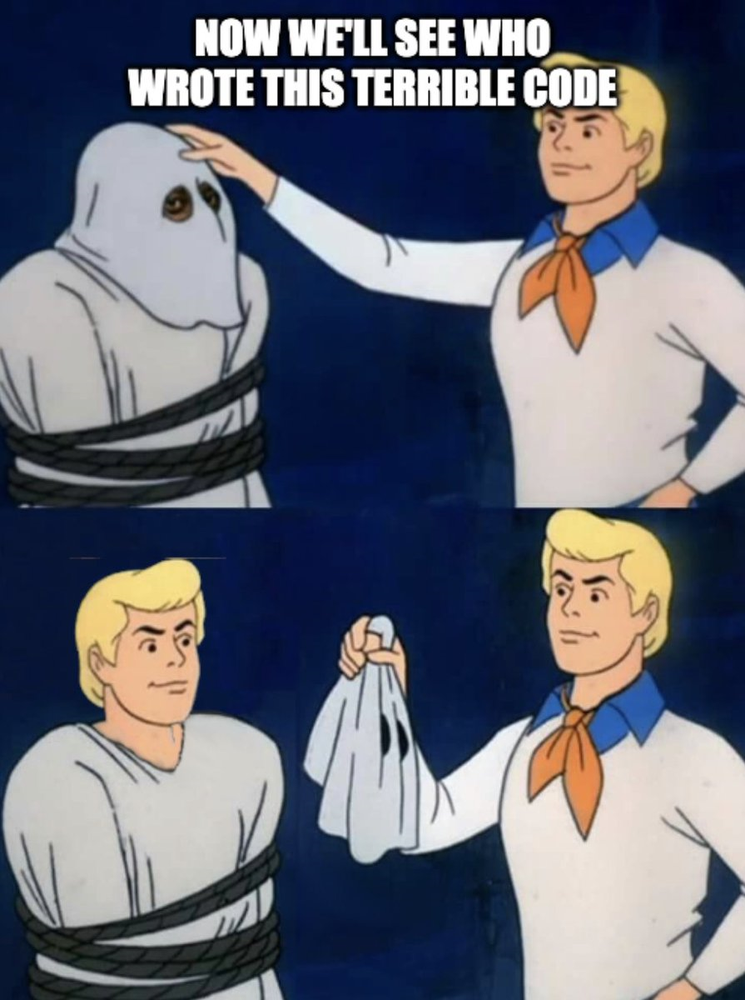
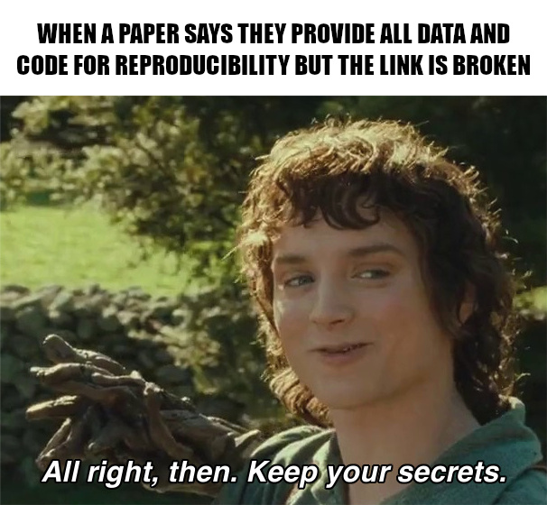
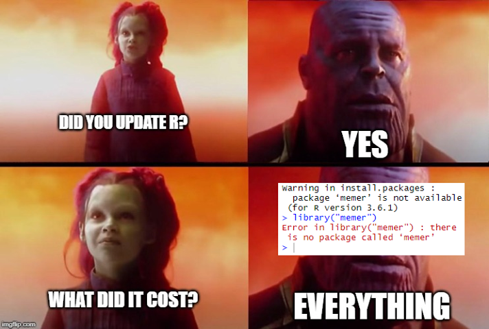
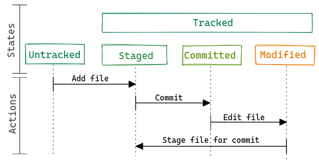
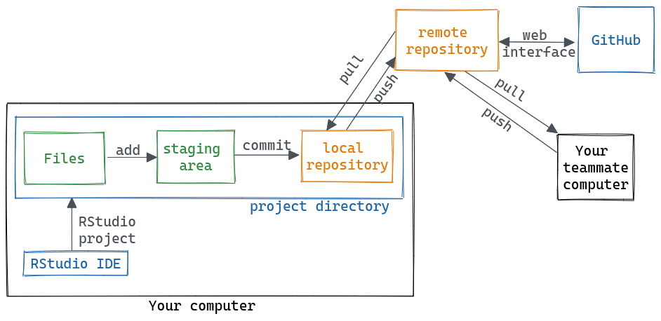
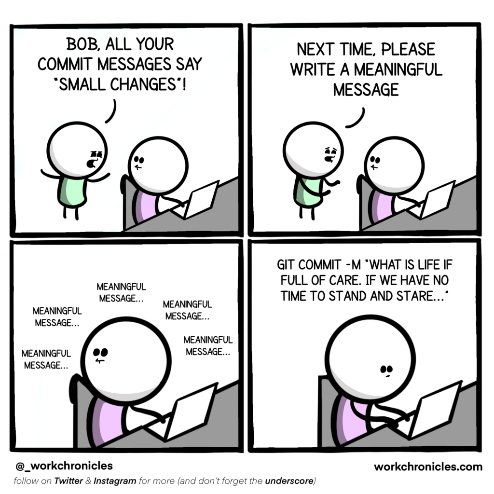
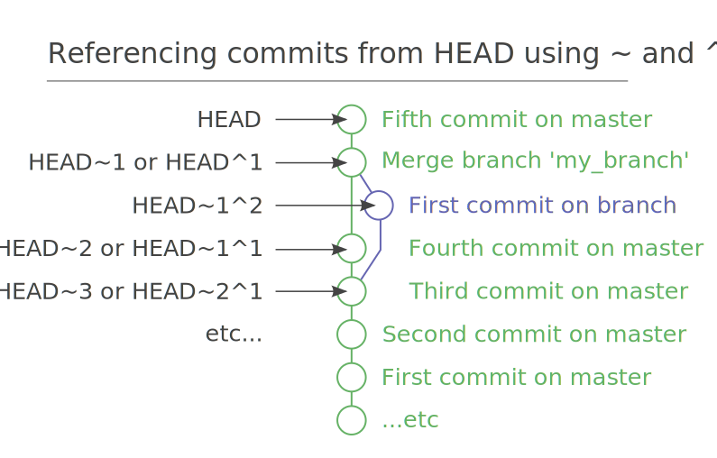

# What, why, when & how? {background-color="#0a4e62" .hide-logo}

# What is git?

::: {.fragment}
Git is a distributed version control system. 
:::
::: {.fragment}
$$ git \ne GitHub $$
:::
::: {.fragment}
CLI tool, but various GUIs exist[^gui]
:::
[^gui]: with slightly different capabilities and names for the same concepts.


# Why use git? {background-color="#0a4e62" .hide-logo}

::: {.r-stack}
{.fragment .nostretch fig-align="left" width="50%"}

{.fragment .nostretch fig-align="right" width="50%"} 

{.fragment .nostretch fig-align="left" width="70%"}

{.fragment fig-align="right" width="60%"}

{.fragment fig-align="left" width="72%"}

{.fragment fig-align="right" width="68%"}
:::

  <!-- Source: https://www.quantitative-biology.ca/scooby-blame.png -->
<!-- Source: PhD comics & https://neurathsboat.blog/post/git-intro/img/notFinal.gif -->
  <!-- Source: https://haines-lab.com/post/asdf-poetry-renv-local-python-r-environments/ -->

## Why use git? {.smaller}

The hope is that it can encourage and facilitate reproducible science, and just make your life easier, by, among other things:

::: {.incremental}
- Providing a free [“backup”]{.bg style="--col: #e64173"} of your code on a remote server like GitHub.
- Allowing you to work "seemlessly" across [different computers]{.bg style="--col: #e64173"} (or servers like CalcUA).
- [Collaborate]{.bg style="--col: #e64173"} at various levels of complexity (from single branch projects up to reviewed pull requests with automated tests)
- Sharing code for [publishing]{.bg style="--col: #e64173"} and making it citable, cf. Zenodo https://tutorials.inbo.be/tutorials/git_zenodo/, https://onderzoektips.ugent.be/en/tips/00002267/, 
- Tracking the [history]{.bg style="--col: #e64173"} of your projects, allowing you to reference specific snapshots in time and see what was changed, why, when and by whom.
- Enabling you to easily [revert mistakes]{.bg style="--col: #e64173"} or to jump back in time.
- Easily deploying a (static) [website]{.bg style="--col: #e64173"} for a project, host readmes or even R/Python notebooks.
- Utilising [project management]{.bg style="--col: #e64173"} tools like issues, wikis or (caveat emptor).
- Facilitating contributing to [open source projects]{.bg style="--col: #e64173"}.
- Making it easier to version [packages and dependencies]{.bg style="--col: #e64173"} (by combining it with tools like `renv`, `conda`/`virtualenv` environments or containers).
:::

# When to use git?

Git is best utilised for [plain-text]{.bg style="--col: #e64173"} files of any kind.

::: {.incremental}
- Code: from smaller scripts to packages and software
- Notes: readme files, personal notes or wiki system, markdown-based articles/presentations/websites/books
  <!-- - Example: description and scripts of reference genomes -->
- LaTeX documents (cf. Overleaf)
- Storing config or dot files (e.g. `.bashrc`)
- Smaller datasets
<!-- (e.g. `.csv` files ~ https://github.com/antigenomics/vdjdb-db/releases) -->
:::

## When not to use git?

Avoid git for binary files (Office documents, images, etc.)[^1] or large files[^2].

[^1]: Adding a small amount of images to your repo won't hurt and can be useful at times, and versioning will work correctly, but you won't easily be able to track their changes.
[^2]: For large files or datasets, check out [git large file storage](https://git-lfs.com/), [DVC - data version control](https://dvc.org/). More info available here: https://book.the-turing-way.org/reproducible-research/vcs/vcs-data/. In general, follow data management best practices.

# How to use git?

](https://imgs.xkcd.com/comics/git.png){fig-align="center"}

## General overview

](assets/img/allison-horst-git-workflow.png){fig-align="center"}

## General overview

{fig-align="center"}


# Further reading {.smaller}

My own creations:

- Introduction + some info on collaboration [beginner]: https://pmoris.github.io/git-workshop/index.html
- How the internals of git work [advanced]: https://pmoris.github.io/git-gud/#/

General guides:

- The Pro Git book, contains everything and more [intermediate]: https://git-scm.com/book/en/v2
- The basics covered in a single page [beginner]: https://rogerdudler.github.io/git-guide/
- Tutorials on various git operations [beginner]: https://www.atlassian.com/git/tutorials/

## Complete overviews for beginners {.smaller}

- General book on reproducible science: https://book.the-turing-way.org/reproducible-research/vcs/vcs-git-in-research/
- Software carpentries workshop: https://swcarpentry.github.io/git-novice/
- Excellent online book by the R celebrity, Jenny Bryan: https://happygitwithr.com/
- Clean and short overview: https://reproducibility.rocks/materials/day2/02-git/
- Step-by-step example slides: https://rdatatoolbox.github.io/chapters/course-git.html
- Shorter but thorough overview: https://r-cubed-intro.rostools.org/sessions/version-control
- Meme-assisted teaching: https://neurathsboat.blog/post/git-intro/
- Great guide by British Ecological Society focused on code for research: https://assets.britishecologicalsociety.org/2025/12/BES-Reproducible-code-guide_2025.pdf (also see their [other guides](https://www.britishecologicalsociety.org/content/better-science-guides/))
- https://rockefelleruniversity.github.io/RU_reproducibleR/presentations/singlepage/github.html
- https://reproducibility-workshop.readthedocs.io/en/latest/day-1/exercise-4-git.html
- I could keep going...

## Interactive visualisations and playgrounds

- [Learn how git branching works interactively](https://learngitbranching.js.org/)
- [Visualizing Git Concepts with D3](https://onlywei.github.io/explain-git-with-d3/) (a brilliant resource to get a feel for what different commands actually do!) 
- [A visual reference guide for most situations in git](https://marklodato.github.io/visual-git-guide/index-en.html)

## Git internals - for those who like to dive deep {.smaller}

- A highly recommended guide for the perplexed (advanced beginners): http://think-like-a-git.net/
- Git from the Bottom Up: https://jwiegley.github.io/git-from-the-bottom-up/
- Git from the inside out: https://maryrosecook.com/blog/post/git-from-the-inside-out

- Visualizing Git’s Merkle DAG with D3.js: https://tylercipriani.com/blog/2016/03/21/Visualizing-Git-Merkle-DAG-with-D3.js/
- Git for Computer Scientists: http://eagain.net/articles/git-for-computer-scientists/
- Git is a Directed Acyclic Graph and What the Heck Does That Mean?: https://medium.com/girl-writes-code/git-is-a-directed-acyclic-graph-and-what-the-heck-does-that-mean-b6c8dec65059

# Specifics {background-color="#0a4e62" .hide-logo}

## Setup and config

```bash
# set username to be associated with commits
git config --global user.name 'BRC-RU'

git config --global user.name
```

```
# set email to be associated with commits
git config --global user.email 'brc@rockefeller.edu'

# show email
git config --global user.email
```

::: aside
This info will be stored in `~/.gitconfig`. The config file can be used to configure various other settings. You can also have a local config in individual repos which override the global settings.

See: https://git-scm.com/book/ms/v2/Getting-Started-First-Time-Git-Setup

Regarding email privacy, see [GitHub's noreply email address](https://docs.github.com/en/account-and-profile/reference/email-addresses-reference#your-noreply-email-address).
:::

<!-- ## GUI vs CLI -->

## Remotes

Hosting services like GitHub, Bitbucket, and GitLab.

All very similar. Slight differences in naming conventions (e.g. pull vs merge requests). Offer different higher-level features like issues, pull requests, wikis, project boards, etc.



## SSH keys

Setup SSH-based authentication so that you can clone/push/pull via the SSH protocol instead of HTTPS (otherwise you have to constantly provide your username).

`git@github.com:pmoris/my-repo.git`

vs

`https://github.com/pmoris/my-repo.git`

::: aside
- https://docs.github.com/en/authentication/connecting-to-github-with-ssh/generating-a-new-ssh-key-and-adding-it-to-the-ssh-agent
- https://confluence.atlassian.com/bitbucketserver/creating-ssh-keys-776639788.html
:::

## Public vs private repositories

Remote repositories can (usually) be made public or private.

You can even keep a git repo local only. So there really is no excuse not to use git from a security/privacy standpoint.

::: {.callout-warning}
## Avoid storing git repositories on OneDrive
:::

## Ignoring things

List files you do not want to track in `.gitignore`.

Useful for sensitive data, secrets, temporary files/caches, etc.

::: aside
Info:

- https://git-scm.com/docs/gitignore
- https://git-scm.com/book/en/v2/Git-Basics-Recording-Changes-to-the-Repository#_ignoring
- https://swcarpentry.github.io/git-novice/06-ignore.html

Templates:

- https://github.com/github/gitignore
- https://www.toptal.com/developers/gitignore
:::

## Branches

https://pmoris.github.io/git-workshop/chapters/5-branching.html

## Diff'ing

- https://www.atlassian.com/git/tutorials/saving-changes/git-diff

## Collaboration

- https://pmoris.github.io/git-workshop/chapters/6-collaboration.html
- https://reproducibility.rocks/materials/day2/02-git/#collaborating-with-others
- https://swcarpentry.github.io/git-novice/08-collab.html

## `git stash`

- https://www.atlassian.com/git/tutorials/saving-changes/git-stash
- https://git-scm.com/book/en/v2/Git-Tools-Stashing-and-Cleaning

## Use meaningful commit messages

](https://imgs.xkcd.com/comics/git_commit.png){fig-align="center"}

::: aside
See: https://cbea.ms/git-commit/ & https://www.conventionalcommits.org/en/v1.0.0/ & https://tbaggery.com/2008/04/19/a-note-about-git-commit-messages.html
:::

## Split up changes with interactive staging

Makes it easier to chunk changes into sensible commits. Cleaner history + easier to selectively undo/apply changes.

Very easy to do with a dedicated GUI or directly within RStudio/VScode.

Alternative, use `git add -i`: https://git-scm.com/book/en/v2/Git-Tools-Interactive-Staging

<!--  -->

# Potential conundrums {background-color="#0a4e62" .hide-logo}

## Fixing things or rewriting history

- https://pmoris.github.io/git-workshop/chapters/3-rewriting-history.html#
- https://git-scm.com/book/en/v2/Git-Basics-Undoing-Things
- https://ohshitgit.com/

## Up-to-date does not mean what you think it means {.smaller}

```bash
$ git status
On branch master
Your branch is up-to-date with 'origin/master'.

nothing to commit, working directory clean
```

<!-- https://www.git-tower.com/learn/git/faq/track-remote-upstream-branch -->

<!-- When git status says up-to-date, it means "up-to-date with the ref/branch that the current branch tracks", which in this case means "up-to-date with the local ref called origin/master". That only equates to "up-to-date with the upstream status that was retrieved last time we did a fetch" which is not the same as "up-to-date with the latest live status of the upstream".

It's telling you about the ref, which is just a commit ID stored on your local filesystem (in this case, it's typically in a file called `.git/refs/remotes/origin/master` in your local repo). -->

::: aside
- https://stackoverflow.com/questions/27828404/why-does-git-status-show-branch-is-up-to-date-when-changes-exist-upstream
- https://pmoris.github.io/git-gud/#/17/1
:::

## Fetch vs pull

`git fetch` will check the remote and tell you about updates.

 `git pull ` will _pull_ them in by running `git fetch` followed by `git merge`.

](assets/img/allison-horst-fetch-pull.png){.nostretch fig-align="center" width="50%"}

## Reset vs checkout vs restore {.smaller}

](assets/img/reset-checkout.png){.nostretch fig-align="center" width="50%"}

::: aside
- https://pmoris.github.io/git-workshop/chapters/3-rewriting-history.html#jumping-around
- https://git-scm.com/book/en/v2/Git-Tools-Reset-Demystified
- https://stackoverflow.com/questions/58003030/what-is-git-restore-and-how-is-it-different-from-git-reset
- https://pmoris.github.io/git-gud/#/16
:::

## Checkout and detached head {.smaller}

{.nostretch fig-align="center" width="75%"}

::: aside
- https://pmoris.github.io/git-workshop/chapters/3-rewriting-history.html#jumping-around
- https://git-scm.com/docs/git-checkout#_detached_head
- https://stackoverflow.com/questions/10228760/how-do-i-fix-a-git-detached-head
:::

# Terminology {.smaller}

- Repository (or repo): place where you store your code, your files, and each file's revision history. 
- Branch: A "branch" is a line of development. The most recent commit on a branch is referred to as the tip of that branch.
  - E.g., `main` and `master`. Check with `git branch -a`.
- `HEAD`: A named reference to the commit at the tip of a branch. See https://jvns.ca/blog/2024/03/08/how-head-works-in-git.
- Remote: A repository stored on a git server like GitHub, instead of it being local to your computer.
  - E.g., Often uses a name like `origin`. Check with `git remote -v`.
- Merging. Take changes from one branch and apply them to another one. Related to pull/merge requests.
- Fast-forward: a simple merge where one branch is a simple linear extension of another.
- Cloning: Downloading a (full) copy of a repository from a remote git server.
- Forking: Creating a new repository that contains a copy of another one (including file history).
- Upstream: The branch on the original repository that was forked.

## Cheatsheet

](./assets/img/git_cli_cheatsheet.png){.nostretch fig-align="center" width="50%"}

## More syntax

::: callout-tip
For more advanced terminology, like `HEAD~`, [fast-forwarding]{.bg style="--col: #e64173"}, reset vs revert, checkout and detached HEAD, see: 

- https://jvns.ca/blog/2023/11/01/confusing-git-terminology/
- https://git-scm.com/docs/gitglossary
:::

## Caret and tilde syntax

{.nostretch fig-align="center" width="60%"}

::: aside
Also see: https://jvns.ca/blog/2023/11/01/confusing-git-terminology/#head-head-head-head-head-2-head-2
:::

<!-- https://r-cubed-intro.rostools.org/sessions/version-control
https://pmoris.github.io/git-workshop/
https://www.google.com/search?q=github+fa-icon&udm=14
https://matduggan.com/why-dont-i-like-git-more/
https://datascience.stackexchange.com/questions/5178/how-to-deal-with-version-control-of-large-amounts-of-binary-data
https://quarto.org/docs/presentations/revealjs/#incremental-lists
https://book.the-turing-way.org/reproducible-research/vcs/vcs-data/
https://neurathsboat.blog/post/git-intro/
https://xkcd.com/1597/
https://www.quantitative-biology.ca/git-and-github.html
https://www.quantitative-biology.ca/scooby-blame.png
https://swcarpentry.github.io/git-novice/
https://happygitwithr.com/
https://r-cubed-intro.rostools.org/sessions/version-control
https://rockefelleruniversity.github.io/RU_reproducibleR/
https://rockefelleruniversity.github.io/RU_reproducibleR/presentations/singlepage/github.html#What_is_Git
https://reproducibility.rocks/materials/day2/02-git/
https://xkcd.com/1296/ -->


<!-- ## Reproducibility

- https://laskowskilab.faculty.ucdavis.edu/2020/08/03/keeping-a-paper-trail-data-management-skills-for-reproducible-science/
- [Ten Simple Rules for Reproducible Computational Research 
https://doi.org/10.1371/journal.pcbi.1003285 ](https://journals.plos.org/ploscompbiol/article?id=10.1371/journal.pcbi.1003285)
- https://reproducibility-workshop.readthedocs.io/en/latest/index.html
- https://book.the-turing-way.org/reproducible-research/
- https://computational-science.mpsd.mpg.de/docs/reproducibility.html
- https://esajournals.onlinelibrary.wiley.com/doi/10.1002/bes2.1801 -->